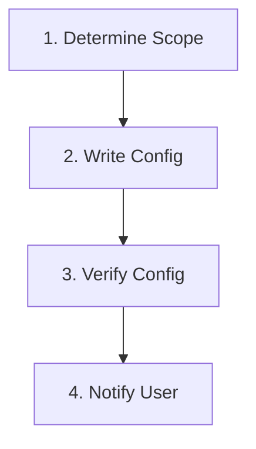

# Skill: Auto Mode for Antigravity (`/auto-mode`)

Configure antigravity to run in auto mode, skipping interactive prompts and using default options.

## Triggers & Slash Commands

- **Slash Commands**: `/auto-mode`
- **Natural Language Triggers**:
  - "enable antigravity auto mode"
  - "turn on antigravity automatic mode"
  - "configure antigravity for hands‑free operation"

## Command Syntax & Options

```text
/auto-mode [--global] [--project] [--reset]
```

- `--global`: Apply setting globally (user home directory).
- `--project`: Apply setting locally to the current project (default).
- `--reset`: Remove auto mode configuration.

## Workflow Steps



---

### Step 1: Determine Scope

1. If `--global` is flagged, target `~/.antigravityrc`.
2. If `--project` is flagged (or default), target `./.antigravityrc`.
3. If `--reset` is flagged, delete the target config file instead of creating it.

### Step 2: Write Config

1. Ensure the target directory exists (`mkdir -p` for parent).
2. Write (or overwrite) the config file with:
   ```ini
   [antigravity]
   auto_mode = true
   ```
   (Adjust format if antigravity uses JSON, YAML, or TOML; assume INI for example.)
3. If `--reset`, remove the file.

### Step 3: Verify Config

1. Confirm the file exists and contains the expected setting.
2. Optionally run `antigravity --help` to ensure the tool is available (if installed).

### Step 4: Notify User

1. Print a short summary indicating success and the config path used.
2. If reset, confirm removal.

---

## Edge Cases & Recovery

| Issue | Cause | Solution |
| :--- | :--- | :--- |
| **Antigravity not installed** | `antigravity` command not found | Skill still writes config; user must install antigravity separately. |
| **Permission denied** | Lack of write rights to target directory | Use `--global` with sudo or choose a writable location. |
| **Invalid config format** | antigravity expects different format | Consult antigravity documentation and adjust the skill accordingly.
