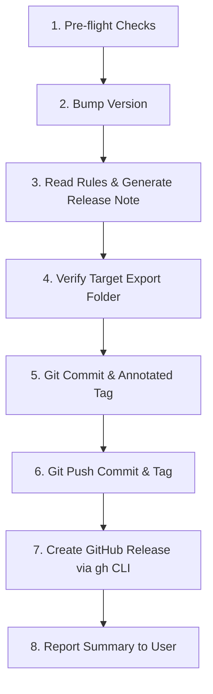

# Skill: Release & Version Bump Automation (`/release-bump`)

Automate end-to-end version bumping, rule-compliant release note creation, Git tagging, and GitHub release creation with attached export artifacts.

## Triggers & Slash Commands

- **Slash Commands**: `/release-bump`, `/released-bump`, `/release`
- **Natural Language Triggers**:
  - "bump version and create release note"
  - "cut a new release"
  - "tag and release with export files"
  - "publish GitHub release"

### Command Syntax & Options

```text
/release-bump [patch | minor | major | <version>] [--export <dir>] [--draft] [--prerelease]
```

- `[patch | minor | major | <version>]`: Bump type or specific SemVer string. Defaults to **`patch`** if omitted.
- `--export <dir>` / `--target-export <dir>`: Path to target export / build artifacts directory (e.g. `export/`, `dist/`, `build/`, `out/`, `release/`).
- `--draft`: Create GitHub release as draft.
- `--prerelease`: Mark GitHub release as a pre-release.

---

## Workflow Steps



---

### Step 1: Pre-flight Verification

1. **Verify Git Status**:
   - Run `git status -s` to inspect working tree status.
   - Ensure the repository is clean or that pending changes are intended to be included in this release.
   - Determine current active branch: `git branch --show-current`.
2. **Verify GitHub CLI**:
   - Check `gh` availability and auth status: `gh auth status`.
   - If not authenticated, prompt user to run `gh auth login` before attempting release publication.
3. **Verify Upstream Sync**:
   - Ensure local branch is up-to-date with remote (`git fetch origin && git status -uno`).

---

### Step 2: Version Bumping

1. **Locate the Version File**:
   Detect the project version file using the following precedence:
   1. `VERSION` file in project root
   2. `package.json` (`"version"`)
   3. `Cargo.toml` (`[package].version`)
   4. `pyproject.toml` (`[project].version` or `[tool.poetry].version`)
   5. `deno.json` / `deno.jsonc` (`"version"`)
   6. Other ecosystem files (`setup.cfg`, `pom.xml`, etc.)
   7. *Fallback*: If no version file exists, create a `VERSION` file starting at `1.0.0`.

2. **Calculate New Version**:
   - Read current version `X.Y.Z`.
   - Apply SemVer bump:
     - `patch`: `X.Y.(Z+1)`
     - `minor`: `X.(Y+1).0`
     - `major`: `(X+1).0.0`
     - Explicit: validate format `X.Y.Z` or `X.Y.Z-prerelease`.

3. **Update Version in File(s)**:
   - Update the version string in the detected file without corrupting formatting or other fields.
   - If updating `package.json`, synchronize corresponding lockfiles if present:
     - Bun: `bun install`
     - npm: `npm install --package-lock-only`
     - pnpm: `pnpm install --lockfile-only`

---

### Step 3: Read Rules & Generate Release Notes

1. **Read Project Release Note Rules**:
   - Search for release note rules in the project/workspace:
     - `.agents/rules/release-note.md`
     - `rules/release-note.md`
     - `.cursor/rules/release-note.md`
     - `GEMINI.md` / `AGENTS.md`
     - Global config rules in `~/.gemini/config/rules/release-note.md`
   - Determine the required file path pattern from the rule:
     - **Default Standard**: `RELEASED_NOTE/{version}.md` (e.g., `RELEASED_NOTE/1.0.1.md`)
     - Legacy pattern (if explicitly dictated by project rule): `RELEASED_NOTE-{version}.md`
   - If target directory does not exist, create it: `mkdir -p RELEASED_NOTE`.

2. **Collect Git Changes Since Last Tag**:
   - Identify previous release tag:
     ```bash
     PREV_TAG=$(git describe --tags --abbrev=0 2>/dev/null || echo "")
     ```
   - Extract commit history between previous tag and HEAD:
     ```bash
     if [ -n "$PREV_TAG" ]; then
       git log "$PREV_TAG..HEAD" --pretty=format:"- %s"
     else
       git log -n 20 --pretty=format:"- %s"
     fi
     ```

3. **Structure & Populate the Release Note**:
   - Categorize changes into:
     - `### Added`: New features, endpoints, components, or files
     - `### Changed`: Modifications, refactoring, performance improvements, updates
     - `### Fixed`: Bug fixes, defect patches, corrective adjustments
     - `### Removed`: Deprecated or deleted functionality
   - Write the file following the standard template:

   ```markdown
   # Release Notes - v{version}

   **Date**: {YYYY-MM-DD}
   **Type**: {patch | minor | major}

   ## Overview
   {1-3 sentences summarizing the purpose and highlights of this release.}

   ## Changes

   ### Added
   - {Item description}

   ### Changed
   - {Item description}

   ### Fixed
   - {Item description}

   ### Removed
   - {Item description, or omit section if none}

   ---
   *Generated by AI Agent on {YYYY-MM-DD}*
   ```

4. **Safety Check**:
   - **Never overwrite prior release notes**. Ensure previous files (e.g. `RELEASED_NOTE/1.0.0.md`) are preserved.

---

### Step 4: Verify Target Export Folder

1. **Resolve Export Directory**:
   - If `--export <dir>` or `--target-export <dir>` was provided, use that directory.
   - Otherwise, detect existing output directories in the project root:
     1. `export/`
     2. `dist/`
     3. `build/`
     4. `out/`
     5. `release/`
     6. `packages/`
     7. `artifacts/`

2. **Verify Artifact Presence**:
   - Check if the target export directory exists and contains files:
     ```bash
     ls -la "<target_export_folder>"
     ```
   - If the directory is missing or empty:
     - Check for project build scripts (`bun run build`, `npm run build`, `cargo build --release`, `uv run python -m build`, etc.).
     - Execute the build command to generate export files, or ask user for confirmation if no build script exists.
     - Inspect and filter files to ensure build artifacts (e.g. `.zip`, `.tar.gz`, `.tgz`, `.js`, `.bin`, `.exe`, binaries) are present and valid.

---

### Step 5: Git Commit & Tag

1. **Stage Changes**:
   - Stage version file(s), lockfile (if updated), and generated release note:
     ```bash
     git add <version_file> [lockfile] RELEASED_NOTE/{version}.md
     ```
2. **Commit**:
   - Create a clean release commit:
     ```bash
     git commit -m "chore(release): v{version}"
     ```
3. **Annotated Tag**:
   - Create annotated Git tag matching `v{version}`:
     ```bash
     git tag -a "v{version}" -m "Release v{version}"
     ```

---

### Step 6: Git Push

Push the release commit and tag to the remote repository:

```bash
BRANCH=$(git branch --show-current)
git push origin "$BRANCH"
git push origin "v{version}"
```

---

### Step 7: Publish GitHub Release via `gh` CLI

1. **Collect Export Files**:
   - Gather all file paths from the target export folder (excluding hidden files or source maps if undesired).
   - Example: `<target_export_dir>/*`

2. **Run `gh release create`**:
   ```bash
   gh release create "v{version}" \
     <export_files...> \
     --title "v{version}" \
     --notes-file "RELEASED_NOTE/{version}.md" \
     [--draft] \
     [--prerelease]
   ```

3. **Verify Creation**:
   - Check CLI response for release URL (e.g., `https://github.com/<org>/<repo>/releases/tag/v{version}`).

---

### Step 8: Execution Summary

Present a concise summary to the user upon completion:

```markdown
### 🚀 Release v{version} Published

- **New Version**: `v{version}` (bumped from `v{old_version}`)
- **Commit**: `{commit_sha}` (`chore(release): v{version}`)
- **Git Tag**: `v{version}`
- **Release Note**: `RELEASED_NOTE/{version}.md`
- **Export Folder**: `{target_export_dir}` ({N} files attached)
  - `artifact-1.tar.gz` ({size})
  - `artifact-2.zip` ({size})
- **GitHub Release**: {release_url}
```

---

## Edge Cases & Recovery

| Issue | Cause | Solution |
| :--- | :--- | :--- |
| **Uncommitted changes** | Working tree has uncommitted edits | Ask user whether to include in release commit or stash before proceeding. |
| **Tag already exists** | `v{version}` tag was previously created | Abort and inform user. Increment patch/minor version or delete stale tag. |
| **`gh` authentication failed** | GitHub CLI token missing or expired | Run `gh auth status` and instruct user to run `gh auth login`. |
| **Export folder is empty** | Build step hasn't run or output folder changed | Execute `build` script or prompt user for correct export path via `--export`. |
| **Remote push rejected** | Branch protection or behind upstream | Fetch and rebase before tagging, or verify branch push permissions. |
